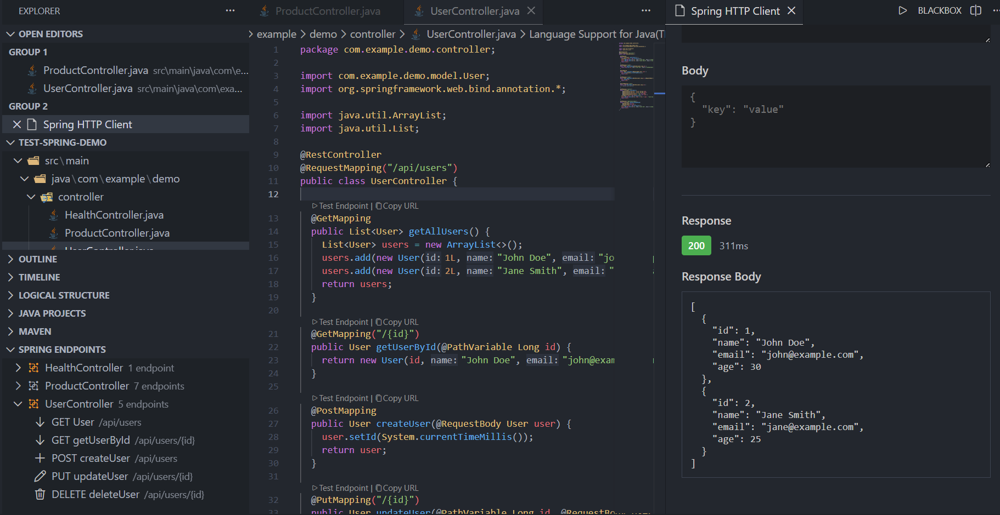
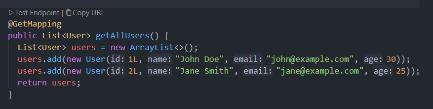
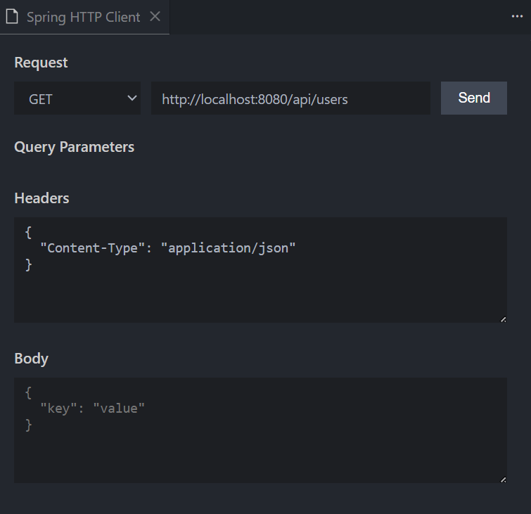
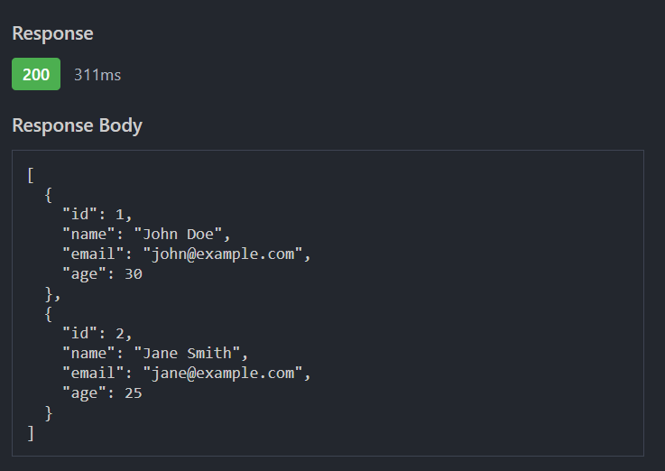

# Spring Endpoints Tester

> **Free IntelliJ IDEA Ultimate alternative for VS Code**

Test your Spring Boot REST endpoints directly from VS Code! This extension brings the premium features of IntelliJ IDEA Ultimate to VS Code, completely free.



##  Features

###  **Automatic Endpoint Detection**
- Automatically scans your Java project for Spring REST endpoints
- Detects `@RestController`, `@Controller`, and all mapping annotations
- Extracts HTTP methods, paths, parameters, and more

###  **Spring Endpoints Panel**
- Tree view of all detected endpoints grouped by controller
- Click on any endpoint to navigate to its source code
- Quick access to test or copy URL


###  **CodeLens Integration**
- Clickable icons appear directly in your code above endpoint methods
- "Test Endpoint" - Opens HTTP client with pre-filled request
- "Copy URL" - Copies endpoint URL to clipboard



###  **Integrated HTTP Client**
- Beautiful WebView-based HTTP client
- Pre-fills URL, method, headers, and parameters from endpoint definition
- Syntax highlighting for JSON responses
- Shows response status, headers, and timing
- Support for query parameters, path variables, and request bodies



*Example of a POST request with auto-generated JSON body*



*Response with syntax highlighting and timing information*

###  **Auto-Refresh**
- Watches for changes in Java files
- Automatically refreshes endpoint list when files are modified
- Real-time updates to CodeLens

##  Installation

1. Open VS Code
2. Go to Extensions (Ctrl+Shift+X)
3. Search for "Spring Endpoints Tester"
4. Click Install

Or install from command line:
```bash
code --install-extension yourname.spring-endpoints-tester
```

##  Usage

### 1. Open a Spring Boot Project
Simply open any Spring Boot project in VS Code. The extension will automatically activate.

### 2. View Endpoints
- Open the **Spring Endpoints** panel in the Explorer sidebar
- All detected endpoints will be listed, grouped by controller

### 3. Test an Endpoint
**Method 1: From CodeLens**
- Open any controller file
- Click the "▶ Test Endpoint" link above a method

**Method 2: From Tree View**
- Click the play icon next to any endpoint in the panel
- Or right-click and select "Test Endpoint"

**Method 3: Manual**
- Click the browser icon in the Spring Endpoints panel title
- Manually enter request details

### 4. Copy Endpoint URL
- Click "Copy URL" from CodeLens or tree view context menu
- The full URL (base URL + path) is copied to clipboard

##  Configuration

Configure the extension in VS Code settings:

```json
{
  // Base URL for your Spring Boot application
  "springEndpoints.baseUrl": "http://localhost:8080",
  
  // Automatically scan for endpoints on startup
  "springEndpoints.scanOnStartup": true
}
```

## 🎓 Supported Annotations

The extension detects the following Spring annotations:

**Class-level:**
- `@RestController`
- `@Controller`
- `@RequestMapping`

**Method-level:**
- `@GetMapping`
- `@PostMapping`
- `@PutMapping`
- `@DeleteMapping`
- `@PatchMapping`
- `@RequestMapping`

**Parameter-level:**
- `@PathVariable`
- `@RequestParam`
- `@RequestBody`

##  Example

Given this Spring controller:

```java
@RestController
@RequestMapping("/api/users")
public class UserController {
    
    @GetMapping("/{id}")
    public User getUser(@PathVariable Long id) {
        // ...
    }
    
    @PostMapping
    public User createUser(@RequestBody UserDTO dto) {
        // ...
    }
    
    @DeleteMapping("/{id}")
    public void deleteUser(@PathVariable Long id) {
        // ...
    }
}
```

The extension will detect:
- `GET /api/users/{id}`
- `POST /api/users`
- `DELETE /api/users/{id}`

##  Comparison with IntelliJ IDEA Ultimate

| Feature | Spring Endpoints Tester (Free) | IntelliJ IDEA Ultimate ($$$) |
|---------|-------------------------------|------------------------------|
| Endpoint Detection | ✅ | ✅ |
| HTTP Client | ✅ | ✅ |
| CodeLens Integration | ✅ | ✅ |
| Tree View | ✅ | ✅ |
| Auto-refresh | ✅ | ✅ |
| Free | ✅ | ❌ |

##  Development

Want to contribute? Great!

```bash
# Clone the repository
git clone https://github.com/mamadoujuniorsy/spring-endpoints-tester

# Install dependencies
npm install

# Open in VS Code
code .

# Press F5 to launch extension in debug mode
```

## 📋 Roadmap

- [ ] Support for Spring Security annotations (`@PreAuthorize`, etc.)
- [ ] Auto-detect Spring Boot port from `application.properties`
- [ ] Support for multiple Spring profiles (dev, prod, etc.)
- [ ] Integration with Spring Actuator
- [ ] GraphQL endpoint support
- [ ] Export to Postman/Insomnia collections
- [ ] Generate unit tests for endpoints
- [ ] Kotlin support

##  Known Issues

- Currently only supports Maven/Gradle projects with standard structure
- Does not support programmatic routing (WebFlux router functions)

##  License

MIT License - See LICENSE file for details

## Acknowledgments

Inspired by IntelliJ IDEA Ultimate's excellent Spring Boot integration.

##  Support

Found a bug or have a feature request?
- Open an issue on GitHub
- Email: mamadoujunior2002@gmail.com

---

**Enjoy! ⭐ Star this project on GitHub if you find it useful!**
